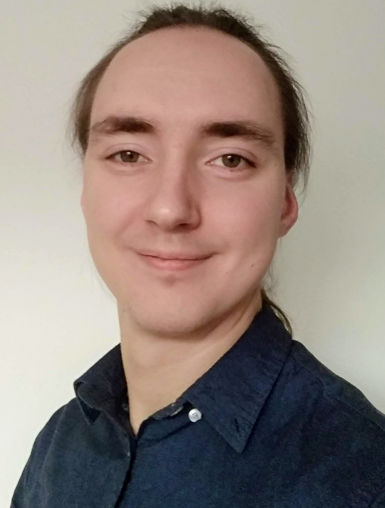

# Welcome!

I'm **Damian Machlanski**, currently a Computer Science PhD student at the University of Essex, jointly under the Department of Computer Science and Electronic Engineering (CSEE) and the Research Centre on Micro Social Change (MiSoC). Prior to my doctoral years, I studied Artificial Intelligence (MSc) at Essex and Computer Science (BEng) at the West Pomeranian University of Technology in Szczecin. In between my BEng and PhD, I also worked as a Software Developer -- mostly backend and mobile stuff.

To find out more about my research, look [here](research.md).